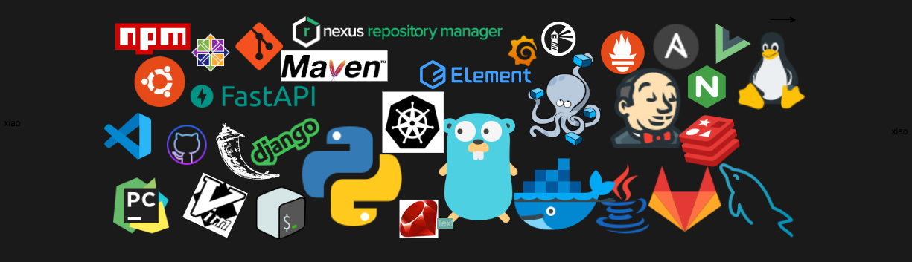

<h1 align="center">Hi 👋, I'm xiaoshenwei</h1>

- 🔭 I’m currently working on **hangzhou**

- 🌱 I’m currently learning **go**

- 💬 Ask me about **python, shell, docker, jenkins**

**Connect with me:**

<h3 align="left">Languages and Tools:</h3>

            

&nbsp;

